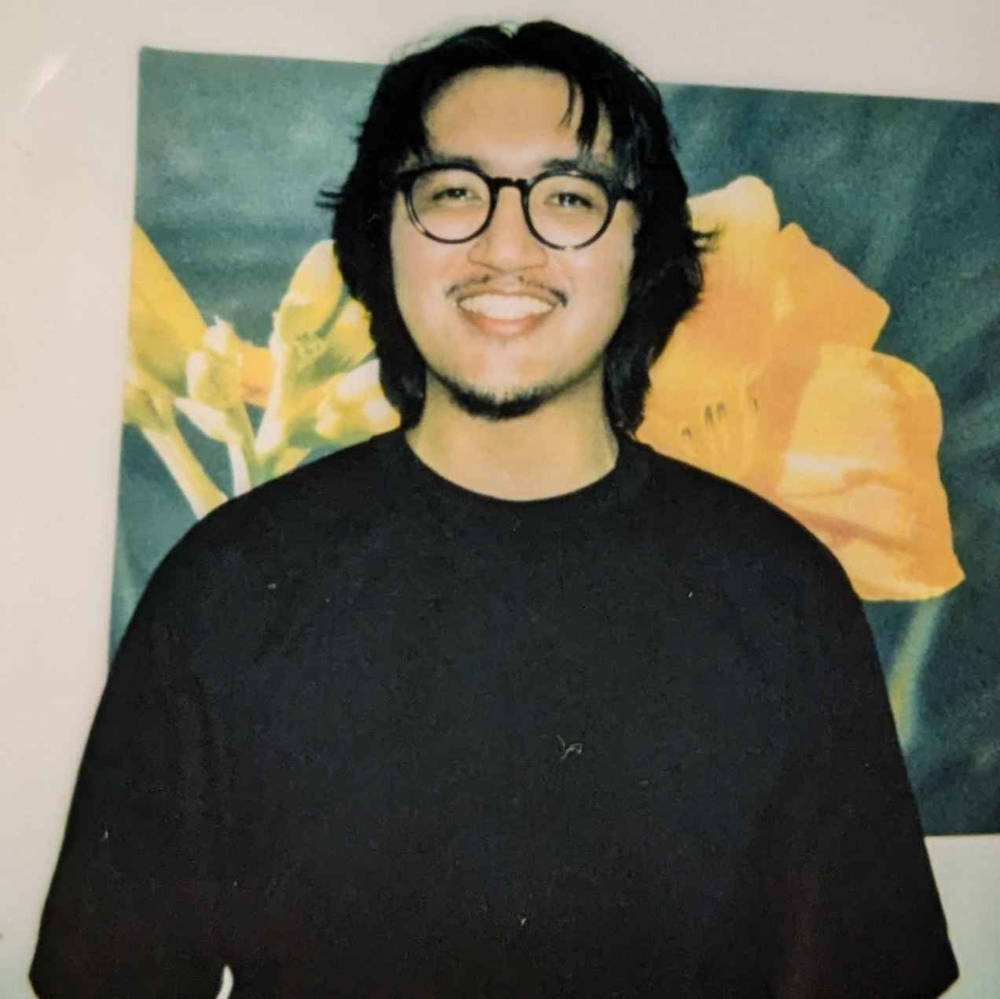

# Anthony Andres - Portfolio 2024

#### This website contains relevant projects outside of any projects done for school that are listed elsewhere in my GitHub account!

#### Technical Skills: Java, C, Python, Blender, Soldering, Sewing, Music Production/Audio Design 

## List of Projects
- Walkman WM-F73 Repair (_August 2024_)								       		
- CRT Television Modification (_July 2024 & October 2023_)	 			        		
- Apron and Tote Bag (_August 2023_)
- DIY Amplifier Circuit for USB Microphone (_March 2022_)
- Hand Soldered Microphone (_January 2022_)

## Walkman WM-F73 Repair 
Got my hands on a walkman in decent physical condition. Took a look on the inside to find that the electrolytic capacitors had gone bad and leaked electrolytic solution all over the PCB. The nice thing about repairing older electronics is that almost always user repair was made much simpler with the availability of service manuals. I took a look at the layout of the faulty components and simply replaced them. the capacitors that were replaced were SMD or surface-mount devices. These types of components are mostly very small and are no easy task to solder. Thankfully, i've got enough experience soldering to know the proper conditions while soldering to ensure no damage. 

## CRT Television Modification
One of the largest interests I have is music and analog technology, and what better way to enjoy those hobbies than by combining them! CRT, or cathode ray tube, televisions make use of electrons fired at a specific surface to create images that we see on a screen. We can modify the CRT within a television to act similarily to how oscilloscopes function by feeding the CRT with an audio signal instead. This modification is simple enough in terms of soldering, since it only requires soldering audio wires to specific points of the CRT. However, there is some danger in doing so, since CRT televisions deal with very high voltages, it is very very important to discharge any points of high charge before touching around inside. 

## Apron and Tote Bag
I've always been interested in expressing my creativity in as many ways as I can, and to no suprise I found interest in doing so by sewing. Although I am still very new to sewing, I aim to hone my skills enough so that I can create my own patterns as well as modify patterns of existing clothing that I particularily like. For my first sewing project I decided to start simple and create an apron and tote bag. This experience allowed me to really understand and get a feel for the sewing machine. I decided to use multiple types of fabrics, as a result this allowed to learn first hand about various sewing topics like tension, types of needles, speed of sewing, as well as overall practice handling the machine.

## DIY Amplifier Circuit for USB Microphone
Once again combining analog technology and music/audio! This time I followed DIY Perks video on his USB-C microphone. I used his design for the amplifier circuit and USB connectivity, but used a microphone that I wired together using this [JLI microphone capsule](https://www.jlielectronics.com/microphone-capsules/jli-2555bxz3-gp/).
[DIY Perks microphone](https://www.youtube.com/watch?v=LoQu3XXIayc)

## Hand Soldered Microphone
Not to be confused with the microphone I talked about in the above section, but this microphone is meant to be used with any audio interface that provides 48V phantom power. For this project I used [DJJules](https://www.instructables.com/OPA-Based-Alice-Microphones-a-Cardioid-and-a-Figur/) OPA based microphones that he worked together with JLI Electronics to create PCB's for. This was the most simple of my projects as it just required basic soldering skills to complete.

